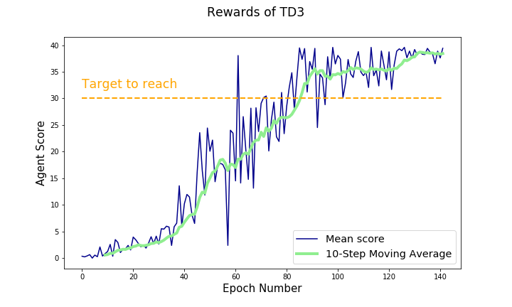

# Report

## 1. Deep Reinforcement Learning Architecture
In this project, the TD3 algorithm is implemented to solve the continous control robot task.
- Initialise a replay buffer (from the ReplayBuffer.py file) as the agents memory
- Replay buffer holds BUFFER_SIZE number of training exploration and samples BATCH_SIZE number of these for learning iteratively at each step.
- An online / local actor (policy) and critic (Q-value) network is initialized. 
- Soft updates are used for adjusting the weight matrices in the corresponding actor and critic target networks
### TD3 learning:
  - TD3 is similar to DDPG learning, however stabilizes value estimations through generating two Q-networks (pair, thus the name Twin in TD3)
  - TD3 moreover uses delayed updates of the actor networks (to guarantee stabilisation of the critic has occured before), which is controlled by the hyperparameter policy_freq in the TD3_Agent.py learn-function
  - action noise regularisation is applied to compensate for lack of epsilon-greediness
### Training:
 - the agent is trained for n numbers of episodes with a max_t number of timesteps per one episode or ends before if reaching a terminal state (dones)
 - inside the training loop, the agent acts (randomly at the start), appends SARS' sequences to memory and learns from them
 
 ### Actor Architecture
 - input dimension = state_space = int 33
 - output dimension = action_space = int 4
 - network is composed of two hidden (with dimensions 400 and 300) and one final output layer (dimensions = actor space), all of them using nn.Linear()
 - after the input layer, batch normalization is applied
 - for hidden layer, activation is relu, for output layer a tanh activation follows
 
### Critic Architecture
 - input dimension = state_space = int 33; first hidden layer returns 400 outputs
 - after the first hidden layer (input layer), state and action spaces are concatenated
 - second hidden layer sees 400 + action_size number of inputs; outputs = 300 nodes
 - after batch normalization, the final layer outputs a single value (Q-estimation)
 - for hidden layers, relu activation followed, final layer returns non-activated output
 
## 2. Hyperparamters
```
### Network parameters
FC1_UNITS = 400             # Number of neurons in the first hidden layer of Actor
FCS1_UNITS = 400            # Number of neurons in the first hidden layer of Critic
FC2_UNITS = 300             # Shared number of neurons for second hidden layer in both

### Agent parameters
BUFFER_SIZE = int(1e5)      # length of internal memory
BATCH_SIZE = 256            # number of samples selected for each learning step
GAMMA = 0.99                # discount factor
TAU = 1e-3                  # control for soft updates
LR_ACTOR = 2e-4             # Learning Rate for Actor
LR_CRITIC = 2e-4            # Learning Rate for Critic
WEIGHT_DECAY = 0            # weight_decay
NOISE_DECAY = 0.999         # iteratively reduce noise 

### Training parameters
N_EPISODES = 2000           # training iterations
MAX_T = 10000               # maximum number of steps per episode
PRINT_EVERY = 100           # control statistics outputs
```

## 3. Opinion


### TD3 Learning appears to hold great promise in improving deep reinforcement learning techniques, as compared to many other algorithms to solve this task that I found online, it reaches a high quality policy very fast. Moreover, despite one single collapse around epoch 55-60 (from which the policy recovered immediately), it appears much more stable than classical DDPG or PPO solutions that I tried out in direct comparison and in the end achieves very stable results with average scores continously over 35. In parallel learning however it takes quite a while to execute, so although the total number of epochs to achieve a stable policy is much lower than in other algorithms, the high quality might go at the expense of higher training times.

## 4. Outlook
- [Rainbow](https://arxiv.org/pdf/1710.02298.pdf): Rainbow networks apply several improvements over the classical DQN network and might help improving performance of the Critic's Q-value estimation.
- [Asynchronous Actor Critic](https://arxiv.org/pdf/1602.01783.pdf): Here multiple independant agents are created in the environment and trained in parallel. 
- [Monte Carlo Tree Search](https://science.sciencemag.org/content/362/6419/1140/tab-pdf): Currently, the TD3 model as implemented here only consides deciding on the next state based on the current state. In Monte Carlo Tree Search a parent tree with multiple leaf nodes can be created to expand looking into the future not only towards the next state, but towards n number of states in the future and deciding the current strategy based on possible favourable decisions that lay much further in the future.
